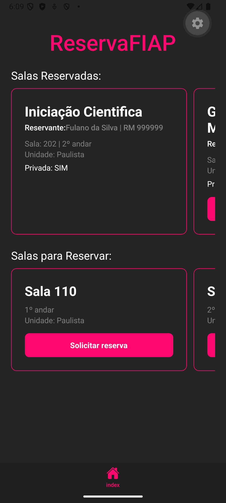
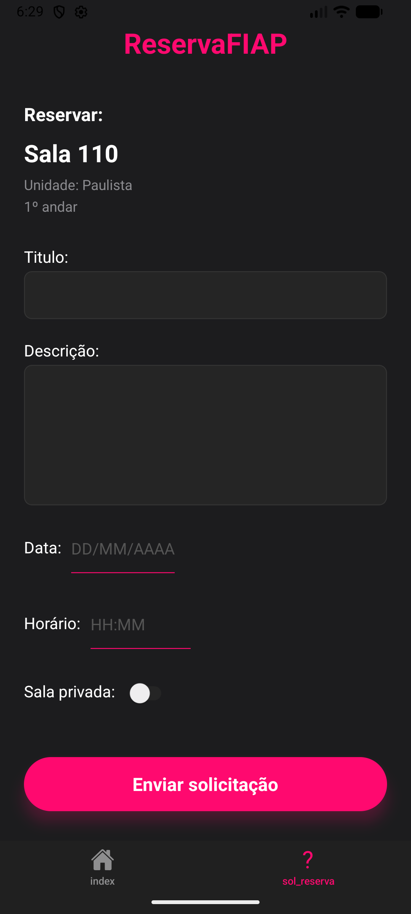
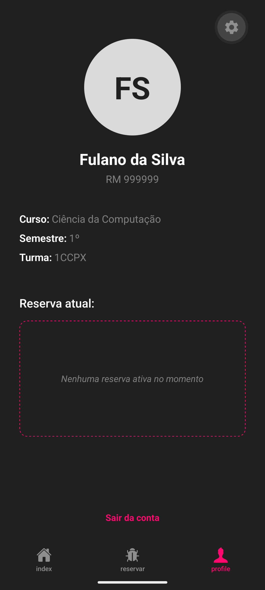
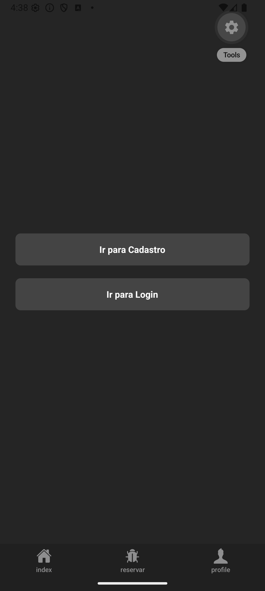
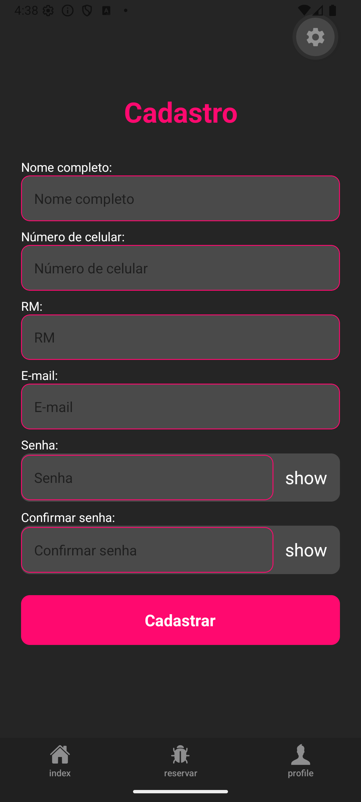

# ReservaFIAP


Aplicativo mobile desenvolvido com React Native e Expo para apoiar a reserva de salas da FIAP. A proposta do projeto é centralizar a visualização de salas disponíveis, reservas já criadas e o fluxo inicial de cadastro de usuário.

## 👥 Developers

<div style="display: flex; gap: 10px;">
    <p><b>Arthur Reis Batista da Silva</b></p>
    <a href='https://github.com/ArthurReisBS' target='_blank'></a>
    <a href='https://www.linkedin.com/in/arthur-reis-4a0253310/' target='_blank'></a>
</div>

<div style="display: flex; gap: 10px;">
    <p><b>Carolina Monteiro Bernardo</b></p>
    <a href='https://github.com/cabernardom' target='_blank'></a>
    <a href='https://www.linkedin.com/in/carolina-bernardo-72067a1aa/' target='_blank'></a>
</div>

<div style="display: flex; gap: 10px;">
    <p><b>Leonardo de Magalhães Piassa</b></p>
    <a href='https://github.com/Leonardo2106' target='_blank'></a>
    <a href='https://www.linkedin.com/in/leonardo-piassa/' target='_blank'></a>
</div>

## 📋 Sobre o projeto

O ReservaFIAP foi pensado para que alunos possam organizar encontros acadêmicos e colaborativos em salas da faculdade. O app cobre hoje um MVP com navegação por abas e telas focadas em:

- visualização de salas reservadas
- visualização de salas disponíveis para reserva
- formulário de solicitação de reserva
- tela de perfil com dados mockados
- fluxo de entrada para cadastro e login

## 🛠️ Stack utilizada

- React Native
- Expo
- Expo Router
- AsyncStorage

## Estrutura atual

Principais arquivos do app:

- [ReservaFIAP/app/index.js](ReservaFIAP/app/index.js): lista de salas reservadas e disponíveis
- [ReservaFIAP/app/reservar.js](ReservaFIAP/app/reservar.js): formulário de solicitação de reserva
- [ReservaFIAP/app/cadastro.js](ReservaFIAP/app/cadastro.js): cadastro de usuário com persistência local
- [ReservaFIAP/app/sign.js](ReservaFIAP/app/sign.js): tela de entrada com navegação para cadastro e login
- [ReservaFIAP/app/profile.js](ReservaFIAP/app/profile.js): perfil do usuário
- [ReservaFIAP/app/_layout.js](ReservaFIAP/app/_layout.js): configuração das tabs do aplicativo

## 🎯 Mudanças recentes

O fluxo de cadastro foi atualizado para salvar os dados do usuário localmente com `AsyncStorage`.

O que foi implementado:

- persistência dos dados de cadastro na chave `@reservafiap:user`
- armazenamento de `nome`, `numero`, `rm`, `email` e `senha`
- validação básica dos campos antes de salvar
- limpeza do formulário após cadastro bem-sucedido
- tratamento simples de erro caso a gravação falhe

Observação importante:

- neste momento os dados ficam armazenados apenas localmente no dispositivo
- a senha está sendo salva apenas para viabilizar o fluxo acadêmico atual do checkpoint
- ainda não existe autenticação real, controle de sessão ou integração com backend

## 🖥️ Estado atual do produto

Hoje o app funciona como um protótipo navegável com dados majoritariamente mockados. O cadastro já consegue registrar um usuário localmente, mas esse dado ainda não está integrado ao login nem sendo exibido dinâmicamente no perfil.

## 📉 Próximos passos

- implementar a tela e a lógica de login usando os dados salvos no `AsyncStorage`
- carregar automaticamente o usuário persistido ao abrir o app
- refletir os dados cadastrados na tela de perfil
- persistir também dados de reservas criadas pelo usuário
- criar fluxo de logout e limpeza controlada da sessão local
- melhorar validações de formulário, mensagens de erro e segurança do armazenamento
- substituir persistência local por backend/API quando o projeto avançar para uma versão mais completa

## 🖼️ Capturas de tela (Release)








## 📦 Como executar

Pré-requisitos:

- Node.js
- npm
- Expo Go

1. Clone o repositorio:

```bash
git clone https://github.com/Leonardo2106/fiap-cpad-cp2-ReservaFIAP.git
```

2. Acesse a pasta do app:

```bash
cd fiap-cpad-cp2-ReservaFIAP/ReservaFIAP
```

3. Instale as dependências:

```bash
npm install
```

4. Inicie o projeto:

```bash
npx expo start
```

5. Abra no celular com o Expo Go ou execute em emulador.

#
